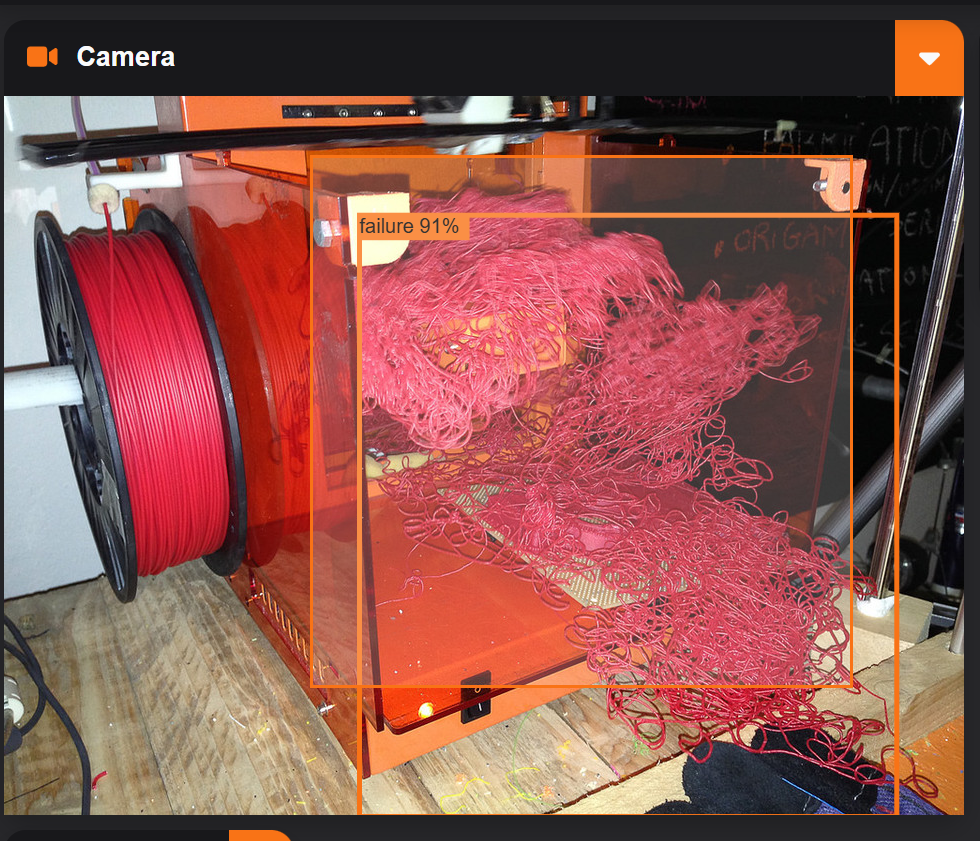

The failure detection feature is the most important feature of Forgetti.

## Configuration

The configuration of the detection feature is fairly straightforward, and it is done almost entirely in the <i>General</i> widget of the configuration menu.

### Camera URL
* This is the URL of your camera stream.
* Forgetti only supports MJPEG streams with programs like ustreamer or mjpeg-streamer. 

### Confidence Threshold
* This is the minimum confidence required for Forgetti to respond to a failure.
* For example, a confidence threshold of 60% forces Forgetti to only respond to failures with a confidence of 60% or higher.

### CPU Threshold
* This is the maximum CPU usage Forgetti will withstand before temporarily pausing inference.
* This prevents Forgetti from crashing other processes such as Klipper.

### Report Cooldown
* This is the amount of time Forgetti will wait before reporting a second failure.
* This is necessary to ensure that the same failure isn't reported more than once.

### Model
* This is the YOLOv8 model that Forgetti will use.
* Although beefier models may have higher mAP scores, they have higher processing times and may not work on weaker hardware.
* **Bigger does not always mean better.**

{{ read_csv('models.csv') }}

## Detection Area Cropping
You can specify areas for Forgetti to monitor by drawing bounding boxes on the camera stream. Simply click and drag to create a box. Forgetti will only report failures detected within these boxes. If no bounding boxes are defined, the entire camera feed will be monitored.

